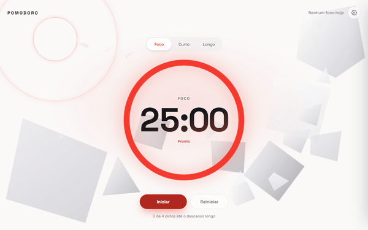
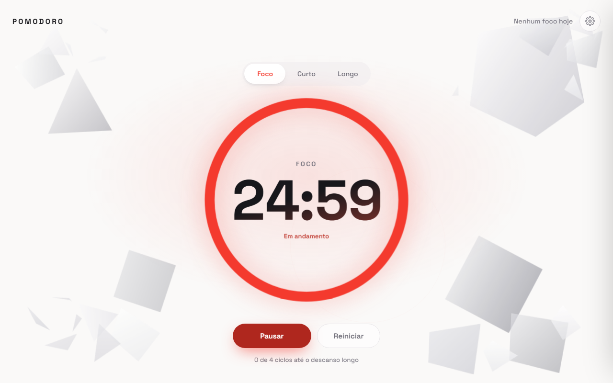
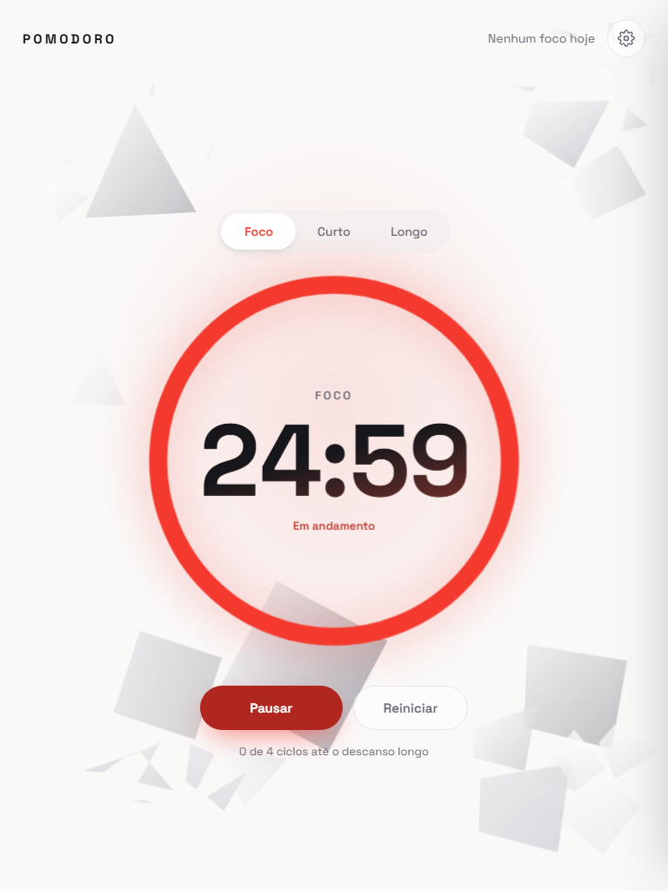
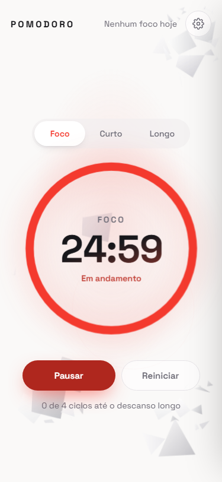

# Pomodoro 🍅

Um timer para você focar em blocos de tempo — com um fundo vivo de polígonos 3D que
reagem a cada clique, se fragmentam com a explosão e se reconstroem sozinhos enquanto
você trabalha.

> Foco de 25 minutos, pausa curta, pausa longa. Visual estimulante para acompanhar seu
> ritmo sem distrair.

---

## ▶️ Veja em ação

Um polígono se fragmenta com o clique e se reconstrói sozinho após alguns segundos:



---

## 🖼️ O que você vê



| Tablet | Mobile |
| :----: | :----: |
|  |  |

---

## ✨ Recursos para você

- **Timer completo** — sessões de **Foco**, **Pausa curta** e **Pausa longa**, com durações
  configuráveis.
- **Fundo interativo** — polígonos 3D flutuam ao fundo; um **clique** gera uma onda expansiva
  que os fragmenta. Deixe quieto por ~5 segundos e eles se **reorganizam**.
- **Ember burst** — ao concluir uma sessão, uma faísca de cores comemora seu foco.
- **Histórico** — seu progresso fica salvo no navegador (localStorage), inclusive o timer
  em andamento.
- **Notificações** — aviso do navegador quando uma sessão termina.
- **Tema claro/escuro** — segue a preferência do seu sistema, com respeito a quem prefere
  menos movimento (`prefers-reduced-motion`).

---

## 🔬 Uma pincelada por dentro

O fundo não é um GIF — é um **motor de física** rodando em tempo real a cada frame.
Conceitos de verdade, apresentados de forma leve:

### Mecânica 3D
Cada polígono é uma **shard** com posição (`x`, `y`), profundidade (`z`), rotação (`r`) e
amplitude de "respiração" (`ampX`/`ampY`). Elas flutuam suavemente com um movimento
senoidal — como se pairassem em profundidade — e a profundidade é simulada com
`translate3d(...) rotateZ(...)`, dando a ilusão de polígonos em camadas.

### Física (explosão e deslocamento)
Quando você clica, uma **força de repulsão radial** é aplicada a cada peça, com pico no
centro do clique e queda conforme a distância (`∝ 1/(1 + dist/r₀)`). As peças ganham
velocidade, sofrem **atrito/damping**, batem nas **bordas da tela** com restituição e
**colidem entre si** (massa, impulso e correção de posição). Tudo com limite de velocidade
para não fugir do controle.

### Geometria (fragmentação e reconstrução)
Polígonos grandes podem **fragmentar** em peças menores (`clip-path`). Após ~5s sem
interação, os fragmentos **convergem de volta ao contorno original** — são atraídos para
pontos sobre o perímetro (calculado a partir do `clip-path` via `outlinePoint`) e, quando
todos chegam perto, o polígono **reaparece com fade-in** e os fragmentos somem com
fade-out. A região em reconstrução é tratada como **obstáculo sólido**, então nada
atravessa o polígono enquanto ele se forma.

### Arquitetura
O motor está isolado do React:

```
src/background/
├── types.ts            # modelo de dados (Piece, Shard, etc.)
├── constants.ts        # parâmetros de física (repulsão, atrito, colisão…)
├── shards.ts           # polígonos estáticos + estado inicial
├── geometry.ts         # clip-path → contorno → ponto no perímetro
└── simulation.ts       # createSimulation: o "motor" (loop, explosão, reconstrução)
```

O componente `Background3D` é apenas o invólucro: monta os elementos, escuta eventos
(clique, mouse, resize) e delega a `createSimulation`, que roda o `requestAnimationFrame`.
Isso mantém a física **pura e testável**, separada da UI.

---

## 🛠️ Stack

- [Vite](https://vitejs.dev/) + [React 19](https://react.dev/) + [TypeScript](https://www.typescriptlang.org/)
- Testes com [Vitest](https://vitest.dev/) + Testing Library
- Lint com [Oxlint](https://oxc.rs/docs/guide/usage/linter/)

## 🚀 Começando

Requisitos: Node.js ≥ 18.

```bash
npm install     # instala dependências
npm run dev     # abre em http://127.0.0.1:5173
```

## 📜 Scripts

| Comando           | Descrição                          |
| ----------------- | ---------------------------------- |
| `npm run dev`     | Servidor de desenvolvimento (Vite) |
| `npm run build`   | Type-check (`tsc -b`) + build (`vite build`) |
| `npm run preview` | Pré-visualiza o build de produção |
| `npm run lint`    | Oxlint |
| `npm test`        | Vitest (unit) |

## 📁 Estrutura

```
src/
├── background/       # motor do fundo 3D (física, fragmentação/reconstrução)
├── components/       # UI (Background3D, TimerCard, Drawer, Settings, History…)
├── hooks/            # usePomodoro, useHistory
├── lib/              # lógica pura (timer, storage, notify, format)
└── test/             # setup de testes
config/               # vite.config.ts, oxlint.json
docs/
├── DESIGN_REVIEW.md
└── screenshots/
```